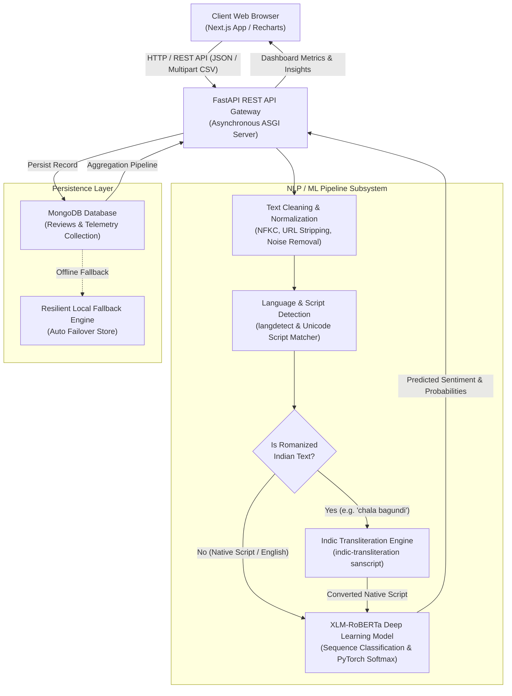
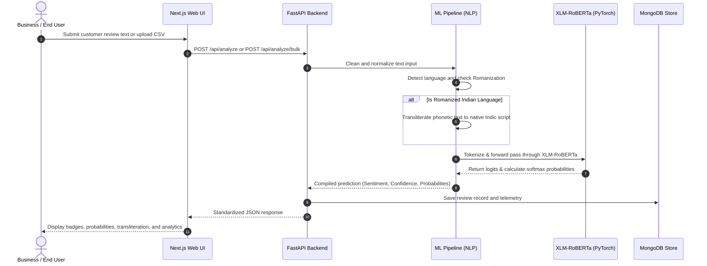
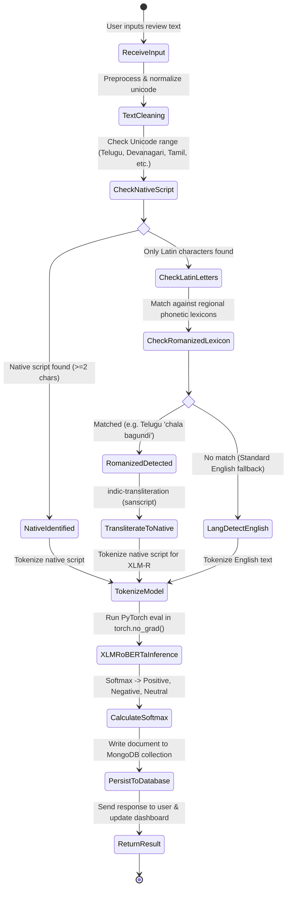
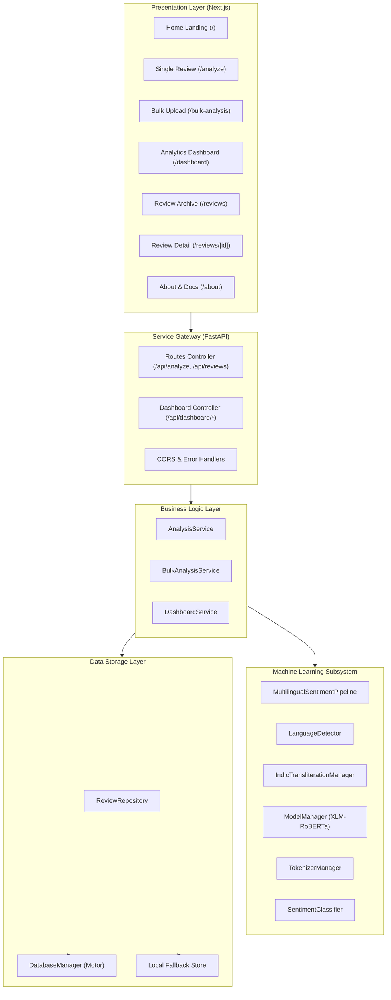

# System Architecture & Technical Specifications

**Project Title:** Multilingual Sentiment and Feedback Analytics for Indian Languages  
**Core Model:** XLM-RoBERTa (Cross-lingual Language Model)  
**NLP Pipeline:** Text Cleaning • Language Detection • Romanized Identification • Indic Transliteration • Transformer Sentiment Classification  
**Backend:** FastAPI • PyTorch • Transformers • indic-transliteration • langdetect • motor  
**Frontend:** Next.js 16 • TypeScript • Tailwind CSS • Recharts  
**Database:** MongoDB Document Store with Resilient Local Persistence Engine  

---

## 1. High-Level System Architecture

The following diagram illustrates the complete end-to-end architecture across Client, API Gateway, ML Processing Engine, and Database layers:



---

## 2. Data Flow Diagram (DFD - Level 1)



---

## 3. Use Case Diagram

```mermaid
graph LR
    actor User["Business Analyst / Reviewer"]

    subgraph System["Multilingual Sentiment Analytics Platform"]
        UC1["Analyze Single Customer Review"]
        UC2["Detect Language & Romanized Script"]
        UC3["Transliterate Phonetic Text to Native Script"]
        UC4["Upload & Process Bulk Reviews (CSV)"]
        UC5["View Feedback Analytics Dashboard"]
        UC6["Filter Metrics by Language, Date, Sentiment"]
        UC7["Read Automated Business Feedback Insights"]
        UC8["Inspect Historical Review Records"]
        UC9["Export Analyzed Dataset as CSV"]
        UC10["Delete Review Records"]
    end

    User --> UC1
    User --> UC4
    User --> UC5
    User --> UC6
    User --> UC7
    User --> UC8
    User --> UC9
    User --> UC10

    UC1 -.-> UC2
    UC2 -.-> UC3
    UC4 -.-> UC2
```

---

## 4. Activity Diagram: Review Analysis Lifecycle



---

## 5. Component Diagram


